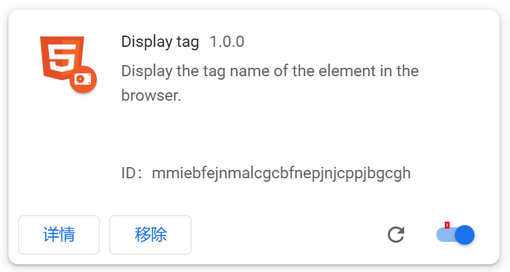
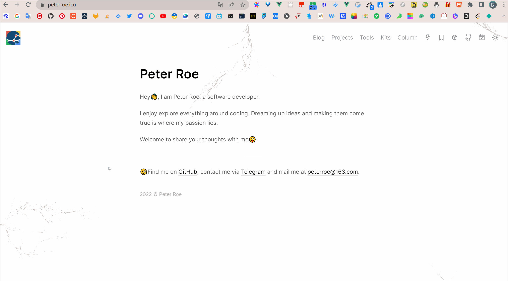

### Display-tag

A chrome plugin to display the tag name of the element in the browser.

### Usage

1. Clone the project to your local

```shell
$ git clone https://github.com/peterroe/chrome-plugin-display-tag.git
```

2. Open the [chrome plugin page](chrome://extensions/) and click the `Load unpacked` button to load the plugin.



1. Open the browser and click the plugin switch to display the tag name of the element.

### Example


 


